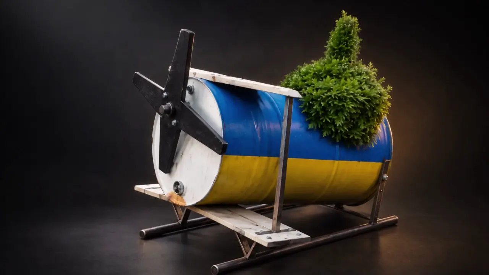

# КЕДР 01 — Земля подождёт

[](https://github.com/dffdeeq/kedr-01/actions/workflows/deploy-pages.yml)

Интерактивный лендинг вымышленного гражданского летательного аппарата. Прокрутка поворачивает КЕДР, разбирает его на узлы и собирает обратно; в конце можно выбрать комплектацию и скачать спецификацию.

**[Открыть сайт →](https://dffdeeq.github.io/kedr-01/)**



## Особенности

- Три главы анимации на canvas: облёт, разборка и сборка. 240 кадров для каждой из двух адаптивных версий.
- Интерактивная схема узлов и локальный конфигуратор с экспортом текстового файла.
- Фильм загружается только после нажатия «Смотреть фильм».
- Управление с клавиатуры, возврат фокуса после закрытия диалогов и статичный режим при `prefers-reduced-motion`.
- Локальные шрифты и медиа. Без API-ключей, бэкенда, сторонней аналитики и отправки заявок. Выбор комплектации хранится только в `localStorage`.

**Стек:** Vite 8, JavaScript, CSS, Canvas 2D, Playwright, ESLint, Prettier. Прямые npm-зависимости закреплены точными версиями; GitHub Actions — SHA коммитов.

## Быстрый старт

Рекомендуется Node.js 24 (версия указана в `.nvmrc`); минимальная версия — 22.12. Для локальных браузерных тестов нужен установленный Google Chrome.

```sh
git clone https://github.com/dffdeeq/kedr-01.git
cd kedr-01
npm ci
npm run dev
```

Откройте адрес из вывода Vite. Сборка для статического хостинга в корне домена:

```sh
npm run build
npm run preview
```

Публикуется только содержимое `dist/`. Preview-сервер предназначен для локальной проверки, а не для production.

## Команды

| Команда            | Назначение                                          |
| ------------------ | --------------------------------------------------- |
| `npm run dev`      | Локальная разработка                                |
| `npm run build`    | Проверка комплекта медиа и сборка `dist/`           |
| `npm run preview`  | Просмотр собранного сайта                           |
| `npm run format`   | Форматирование исходников и документации            |
| `npm run check`    | Форматирование без записи, ESLint и модульные тесты |
| `npm run test:e2e` | Браузерные сценарии на desktop и mobile             |

Тесты проверяют диапазоны кадров, пути GitHub Pages, навигацию по главам, загрузку медиа, конфигуратор, скачивание файла, управление фокусом и reduced motion. Локально используется изолированный headless Chrome, в CI — Chromium из Playwright; личный профиль браузера не затрагивается.

## Структура

```text
.github/workflows/     Проверки pull request и публикация main
public/
  media/              Готовые кадры, постеры и фильм
  fonts-licenses.txt  Лицензии распространяемых шрифтов
scripts/              Проверка медиа и визуальная проверка
src/
  main.js             Canvas, навигация, диалоги и конфигуратор
  sequence.js         Загрузка кадров, приоритеты и ограниченный кэш
  style.css           Дизайн и адаптивные состояния
tests/                Модульные и браузерные тесты
index.html            Семантическая разметка страницы
```

`dist/`, зависимости, тестовые отчёты и рабочие материалы из `output/` не входят в Git. Конфигурационные файлы редактора и файлы с секретами также исключены.

## Плавность анимации

При сборке WebP объединяются в 15 пакетов по 16 кадров для каждого размера экрана — без перекодирования и потери качества. Вместо 240 запросов браузер делает 15. `npm run dev` и `npm run build` создают пакеты автоматически в игнорируемой папке `public/media/packs/`; исходные кадры остаются в Git. При замене изображений измените `FRAME_PACK_VERSION` в `src/sequence.js`, чтобы новые пакеты не пересекались с браузерным кэшем предыдущего набора.

Загрузчик хранит сжатые WebP-файлы отдельно от декодированных кадров. Поэтому возврат к уже скачанному участку не требует новых HTTP-запросов. Очередь заранее загружает пакеты по направлению прокрутки, а подготовка изображений ограничена двумя параллельными задачами. В памяти остаются не более 28 декодированных кадров на телефоне и 40 на компьютере; удалённые `ImageBitmap` освобождаются явно. Неизменившийся кадр не перерисовывается.

Повторяемый замер production-сборки или опубликованного сайта:

```sh
node scripts/measure-sequence.mjs https://dffdeeq.github.io/kedr-01/ --mobile --throttle
```

Скрипт прокручивает анимацию вперёд и назад с холодным и прогретым кэшем. Профиль `--throttle` задаёт 5 Мбит/с, задержку 150 мс и замедление CPU в 4 раза. Это лабораторная эмуляция, а не измерение реального телефона. `exactFramePercent` сравнивает желаемый и действительно показанный кадр на каждом animation frame; `repeatRequests` показывает повторные запросы. Тесты также проверяют границы кэша, освобождение памяти, отмену загрузок и режим без `ImageBitmap`.

## GitHub Pages

Workflow [Check and deploy](.github/workflows/deploy-pages.yml) проверяет форматирование, линтер, модульные тесты, production-сборку и браузерные сценарии. Pull request только проверяется; успешный push в `main` публикует сайт. Возможен ручной запуск из Actions.

В **Settings → Pages → Source** должен быть выбран **GitHub Actions**. Дополнительные ключи не нужны: используется штатный `GITHUB_TOKEN`, право публикации есть только у deploy-job.

Базовый путь берётся из настроек Pages. Проверка production-сборки по адресу `/kedr-01/` в PowerShell:

```powershell
npm run build -- --base=/kedr-01/
$env:PAGES_BASE_PATH = '/kedr-01/'
$env:PLAYWRIGHT_PREVIEW = 'true'
npm run test:e2e
Remove-Item Env:PAGES_BASE_PATH, Env:PLAYWRIGHT_PREVIEW
```

Проверка уже опубликованного сайта без локального сервера:

```powershell
$env:PLAYWRIGHT_BASE_URL = 'https://dffdeeq.github.io/kedr-01/'
npm run test:e2e
Remove-Item Env:PLAYWRIGHT_BASE_URL
```

При смене репозитория или домена обновите ссылки в этом файле, `package.json`, canonical и Open Graph URL в `index.html`.

## Материалы и границы проекта

Изображения и видео аппарата созданы с помощью AI для этого концепта. Визуальной отправной точкой послужил pear.no; сайт не связан с этим проектом. КЕДР 01 — художественная концепция, а не предложение продажи или подтверждение лётных характеристик.

В Git входят только готовые WebP-кадры (1280×720 и 768×432), три изображения и MP4-фильм. Сырые генерации, PDF, монтажные архивы и служебные параметры остаются локально.

Шрифты **Manrope** и **Cormorant Garamond** поставляются через Fontsource; уведомления авторов и SIL Open Font License 1.1 находятся в [public/fonts-licenses.txt](public/fonts-licenses.txt) и включаются в сборку. Лицензия самого проекта пока не выбрана.

Порядок внесения изменений: [CONTRIBUTING.md](CONTRIBUTING.md).
